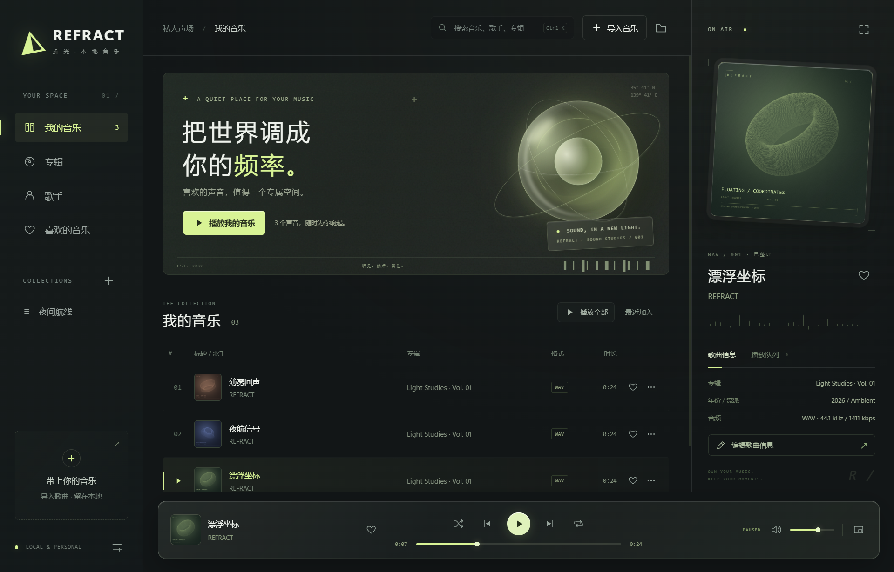

# REFRACT / 折光

**A quiet place for your music.**

一间属于本地音乐的私人声场。冷色玻璃、工业排版，以及安静、直接的播放体验。



上图为深色模式；v0.3.0 默认开启桌面毛玻璃，实际背景会随窗口后方内容变化。

> Windows 桌面原型 · v0.9.1。此前版本在 Windows 11 x64 上实测；本版的三档玻璃已完成编译与逻辑检查，失焦后的材质效果待手动试用。设计参考工业信息界面的排版节奏，图形和声景为本项目原创；不隶属于任何游戏公司。

## 现在能做什么

- 导入本地音乐文件、批量选择文件或递归导入文件夹；按文件路径去重。
- 播放、暂停、前后切歌、拖动进度、音量与静音。
- 顺序播放、随机播放、列表循环、单曲循环。
- 歌曲间交叉淡化：默认 4 秒、可调 1–12 秒或关闭，手动切歌使用 350 毫秒短过渡。
- 歌曲、专辑、歌手、收藏、自建歌单，以及本地搜索和排序。
- 编辑标题、歌手、专辑、年份、曲号、流派；更换封面。
- 每首歌选择或拖入 LRC / SRT / JSON / TXT 歌词；LRC 同步高亮、滚动、点击定位，沉浸模式显示大字歌词。
- 曲库编辑默认不修改原音乐。主动选择“写回音乐文件”时，先创建原文件备份。
- 真正透出桌面与后方窗口的 Windows 桌面毛玻璃；高光边缘与透明播放条。
- 桌面玻璃“关闭／聚焦时启动／保持”三档、0–60% 背景染色深浅调节；文字和封面保持实色。
- 正常、小窗、沉浸三种模式平滑切换；沉浸覆盖任务栏，小窗置顶，支持轻量视觉。
- 32 段实时音频频谱：侧栏与沉浸模式显示，支持开关。
- 桌面悬浮歌词：独立透明置顶窗口、双行同步、拖动位置、锁定穿透、字号与找回窗口。
- 跟随封面配色：本地提取主色，联动高光、歌词、播放条和频谱，支持关闭。
- 播放队列：拖动或键盘排序、下一首播放、加入队列、移除与清空其他。
- 三段 24 秒原创环境声景，首次打开点击“试听折光”即可体验。

## 运行

1. 解压完整的 `Refract-Windows-v0.9.1.zip` 到一个可写文件夹。
2. 打开文件夹中的 **Refract.exe**。请保留同目录的 DLL 和 `web` 文件夹。
3. 首次使用可以点击“试听折光”，也可以直接“导入音乐”。

此精简包依赖：

- [.NET 10 Desktop Runtime x64](https://dotnet.microsoft.com/en-us/download/dotnet/10.0)（选择 **Desktop Runtime**）。
- [Microsoft Edge WebView2 Evergreen Runtime](https://developer.microsoft.com/en-us/microsoft-edge/webview2/)。

复用系统运行时可以缩小下载包，但不等于已完成低内存优化。该版本没有捆绑整套浏览器或 .NET 运行时。

## 桌面液态玻璃（v0.9.1 三档）

在左下角“外观与关于 → 桌面液态玻璃”中选择：

- **关闭**：使用深色实底。
- **聚焦时启动**（默认）：窗口获得或失去焦点时，由 Windows 自然渐变玻璃效果。
- **保持**：窗口失去焦点后继续请求桌面玻璃，不抢占焦点或额外置顶。
- 选择自动保存。旧版开启玻璃的设置迁移为“聚焦时启动”，旧版关闭的设置保留为“关闭”。
- 调节“玻璃深浅”：越靠左越通透，越靠右越深；调节结果自动保存在本机。
- 打开“轻量视觉”时暂停系统桌面毛玻璃，关闭轻量视觉后恢复原玻璃偏好。

桌面层由 Windows DWM Desktop Acrylic 合成。WebView2 使用透明背景，界面表面独立叠加少量染色。没有通过降低整个窗口透明度来淡化文字，也没有采集桌面截图或运行截图循环。当前不是逐像素物理折射效果。

“保持”通过动态加载 Windows 的 `SetWindowCompositionAttribute` 并请求 `WCA_FORCE_ACTIVEWINDOW_APPEARANCE`，同时保留非客户区的活动外观；窗口真实焦点仍由系统管理。“聚焦时启动”持续挂载系统背景材质，仅让 Windows 处理活动与非活动外观，焦点变化不再重新配置材质或切换不透明背景。该属性不是稳定的公开 SDK 契约，调用不可用或失败时按“聚焦时启动”回退并在设置中提示。接口成功只表示系统接受请求，不能替代实际视觉验证；正常、小窗与沉浸模式共用此设置。

需要 **Windows 11 22H2（Build 22621）或更新版本**。旧系统或高对比度模式使用实色背景。若系统透明效果关闭，或系统因节能、远程桌面等原因降级材质，显示结果由 Windows 决定；程序不会修改系统设置。

实现依据：[Windows 系统背景材质文档](https://learn.microsoft.com/en-us/windows/win32/api/dwmapi/ne-dwmapi-dwm_systembackdrop_type)。开发测试可在程序目录临时放置 `glass-test.flag`，启动一个位于播放器后方、每 5 秒变色的独立窗口，验证真实透视；发行包不包含此标记。

## 歌曲间平滑过渡（v0.8.0）

左下角 **外观与关于 → 歌曲平滑过渡**，默认开启 4 秒，可调 1–12 秒或关闭，选择自动保存在本机。

- 自动播放在上一首结尾与下一首开头重叠；两路音量采用平滑的等功率曲线，混合输出带峰值压缩保护。它不是歌曲响度标准化，录音之间本来的音量差仍可能存在。
- 下一首提前加载。加载就绪才开始提前交接；无法准备时等当前歌曲结束再尝试普通播放。读取失败会提示，切歌请求不会提前停掉仍在播放的原歌。
- 手动点击下一首、上一首或其他歌曲使用最多 350 毫秒过渡；暂停状态下选歌直接开始新歌。
- 短曲会限制重叠时间，最多不超过下一首时长的一半；自动触发窗口也不超过当前歌曲时长的一半。
- 单曲循环不重叠自身；队列结束停止，列表循环可过渡回队首。随机队列预加载不会提前消耗歌曲。
- 交接开始后，封面和歌词跟随新歌；封面约 700 毫秒淡出旧图，主题色渐变。轻量视觉和减少动态效果只关闭视觉动画，音频过渡仍按独立设置工作。
- 暂停同时停止两路；恢复时继续当前新歌。拖动进度会结束旧歌尾音。音量和静音统一作用于混合输出。
- 频谱读取混合后的声音。两个媒体元素各自只创建一次 Web Audio 音频源，共享一个输出通路；没有重复播放旁路。

本版实现交叉淡化，不包含节拍检测、变速对拍或自动挑选乐句；关闭过渡也不代表已经实现采样级无缝播放。不同歌曲的人声与节拍可能在重叠时冲突，可缩短时长或关闭。

调度使用 [Web Audio AudioParam](https://developer.mozilla.org/en-US/docs/Web/API/AudioParam) 的音频时钟；界面动画不控制音量曲线。已完成模拟接口检查，实际听感、峰值处理、不同编码与后台播放需要手动确认。

## 桌面歌词、封面配色与队列（v0.7.0）

### 桌面悬浮歌词

打开左下角 **外观与关于 → 桌面悬浮歌词**。

- 独立透明置顶窗口，主播放器最小化时仍可显示。原生时钟按播放、暂停、缓冲与跳转消息同步，不依赖主界面的动画帧。
- 解锁时拖动歌词移动；右上角“锁定”启用鼠标穿透，× 隐藏窗口。在播放器设置中可随时解锁。
- 字号可调 20–44；“找回歌词窗口”会在主显示器底部显示并解锁。
- 开关、锁定、字号和位置保存在本地 `data/desktop-lyrics.json`；播放器退出后歌词窗口一起关闭。
- 同步歌词显示当前句与下一句；当前句有译文或重叠字幕时，优先显示两行当前内容。长句省略显示，完整正文仍可在播放器查看。
- 纯文本或没有歌词时显示歌名和导入提示，不自动猜测时间。

透明与鼠标穿透使用 [Windows 分层窗口](https://learn.microsoft.com/en-us/windows/win32/winmsg/window-features)，不是另一套浏览器窗口。

### 封面取色

“跟随封面配色”默认开启，也可以在设置中关闭。只在本地采样封面，过滤透明、近黑、近白与灰色像素，提取主要彩色区域并生成浅色高光。没有彩色封面或读取失败时回到默认浅绿色。快速切歌时过期的封面不会覆盖新歌的颜色。

### 整理播放队列

- 歌曲列表的 `···` 菜单新增 **下一首播放**、**加入播放队列**。
- 右侧“队列”中拖动左侧手柄排序；也可选中手柄后按 **Alt ↑ / ↓**。
- 手动排序会关闭随机播放；“下一首播放”在随机播放下也有优先级。单曲循环仍会在自然结束时重复当前歌曲，手动下一首可跳转。
- × 只从队列移除；“清空其他”保留当前歌曲。当前正在播放的歌曲不能直接移出队列。
- 队列是本次运行内的安排。点击曲库歌曲或“播放全部”会按当前列表重新建立队列；从右侧队列选歌会保留已整理的顺序。

## 窗口切换与全屏（v0.6.0）

- 底部小窗按钮切换正常窗口和置顶迷你播放器；小窗新增沉浸入口。
- 右侧沉浸按钮或 **F11** 进入当前显示器的无边框全屏，使用完整屏幕尺寸覆盖任务栏。
- **Esc**、**F11** 或右上角“退出沉浸”回到进入前的正常窗口或小窗。打开对话框时 Esc 先关闭对话框。
- 正常窗口和小窗分别记住本次运行中的位置、大小；正常窗口的最大化状态也会恢复。显示器变化后恢复位置会限制在可用屏幕内。
- 切换采用内容淡出、约 260 毫秒窗口缩放、内容淡入；不重建音频元素，播放进度保持。连续请求合并到最新目标。
- 轻量视觉或系统减少动态效果时直接切换；全屏失去焦点后释放置顶，方便 Alt+Tab，重新激活后覆盖任务栏。

本版完成编译、语法与模拟接口逻辑检查。实际全屏任务栏覆盖、动画流畅度、跨显示器缩放与音频连续性留待手动确认。

## 动态频谱（v0.5.0）

播放音乐时，右侧封面与歌曲信息下方会显示 32 根频谱柱；从左到右对应低频到高频。沉浸模式在歌曲信息下方显示同一份分析结果。

- 左下角“外观与关于”→“动态频谱”可以开关，偏好自动保存。
- 暂停、结束、缓冲或静音时柱子逐渐回落；切歌和定位时清空旧数据。
- 轻量视觉、系统减少动态效果偏好、窗口后台/隐藏时暂停绘制；迷你模式不显示频谱。
- 上限约 30 帧/秒；关闭动画不暂停音乐。
- 使用 Web Audio AnalyserNode 读取实际频率数据，分析范围约 45 Hz–16 kHz，具体上限受采样率限制。频段采用对数分组，柱高用于视觉展示，不是校准过的响度测量仪表。
- 音频源由双路播放核心统一管理；频谱只读取混合输出的分析分支，不创建额外音频输出。音量与静音同时作用于两路，不使用麦克风或系统录音。

技术参考：[MDN 音频可视化](https://developer.mozilla.org/en-US/docs/Web/API/Web_Audio_API/Visualizations_with_Web_Audio_API)。本版本完成编译、语法和模拟音频接口的逻辑检查；按用户要求，实际音质、格式兼容、拖动播放与视觉效果留待手动试用。

## 导入与歌曲信息

- “导入音乐”：多选 MP3、FLAC、WAV、M4A 等音乐文件。
- 旁边的文件夹按钮：导入整个目录，包含子目录。
- 也可直接拖入音乐文件。文件夹导入推荐使用文件夹按钮。
- 单击歌曲开始播放；右侧“编辑歌曲信息”或每行的 `···` 菜单可以整理标签。
- 同路径只记录一次；不同路径的相同音频不会按音频指纹合并。
- 源文件被移动或删除后会标示缺失；请恢复原位置或重新导入，再移除失效记录。
- 不复制用户的音乐到应用目录，也不扫描未选择的目录。

### 保存与写回

普通“保存信息”只修改曲库 JSON。更换封面会立即保存到曲库，编辑窗口中有相应提示。

“写回音乐文件…”会先保存当前表单，再提示实际目标路径并请求确认。确认后，在音乐旁生成 `文件名.refract-时间-随机码.bak`，然后写入标签；失败时尝试从该备份恢复原文件。需要写权限。若以后手动恢复，请关闭播放器，将备份改回原文件名。

第一版允许写回 MP3、FLAC、M4A、OGG、WAV、AIFF；其他格式仅编辑曲库。写回测试目前覆盖 WAV，其他写回格式需要更多真实文件验证。音频编码、容器和标签版本的组合很多，请保留备份。

### 格式说明

MP3、FLAC、WAV 和 M4A/AAC 已使用本地生成的文件在 WebView2 中测试播放与定位。其他扩展名能够尝试读取元数据，能否播放取决于系统与 WebView2 的解码能力；不能仅凭扩展名保证播放。

本程序不能解密 DRM 音乐或受保护的流媒体离线下载。

## 导入歌词（v0.4.1）

选中或播放一首歌 → 右侧 **歌词** → **导入歌词 ↗**，选择本地 `.lrc`、`.srt`、`.json` 或 `.txt` 文件。已有歌词时按钮改为“更换歌词”。取消选择不会修改原歌词。

也可以直接把一个歌词文件拖入右侧「歌词」页的显示区；沉浸模式的歌词区同样支持。悬停时显示目标歌曲名称，松手后直接导入；已有歌词会被有效的新歌词替换。目标按松手时的歌曲确定，导入期间切歌不会改变关联。一次拖入多个文件、文件格式不支持或未选择歌曲时会提示。拖到其他区域仍按原有音乐导入处理；只有歌词文件时会提示正确投放位置。

- **LRC**：按播放进度高亮，自动居中；点击一行会跳转并播放。同一时间的原文与翻译合并显示，支持重复时间标签、毫秒时间、`[offset]` 偏移。正 offset 提前显示，负值延后；行为参考 [paroles 的 LRC 约定](https://github.com/Clarkkkk/paroles)。
- **TXT**：保留文字并自由滚动，不做同步定位。没有有效时间标签的 LRC 也按纯文本显示。
- 手动滚动会暂停跟随 5 秒；继续播放时恢复跟随。右上角沉浸按钮可进入大字歌词视图。
- 支持 UTF-8、带 BOM 的 UTF-16 / UTF-32，以及常见中文 GBK / GB18030 编码。无法识别时，请另存为 UTF-8 再导入。
- 歌词正文副本保存在 `data/library.json`，重新启动或移走原歌词文件后仍可阅读。只关联当前歌曲，不会改动原音乐或歌词文件；“写回音乐文件”不包含歌词写回。
- 每份歌词上限 512 KB / 10000 行。暂不提供联网找词和逐字卡拉 OK；增强 LRC 按行时间显示。

### SRT 字幕歌词

支持标准 `00:00:01,000 --> 00:00:03,000` 时间段、毫秒精度和多行双语，也接受小数点形式的毫秒。只在开始到结束之间高亮，间隔处取消高亮，重叠的字幕可同时高亮。点击任意行从该行开始时间播放。基本粗体/斜体等标记会去除，其他内容安全地作为文字显示。格式不正确时提示出错段落，不会覆盖已经保存的歌词。

可直接导入 [SRT 示例](examples/lyrics.srt)。时间段规则参考 [SubRip 格式说明](https://www.loc.gov/preservation/digital/formats/fdd/fdd000569.shtml)。

### JSON 歌词格式

JSON 没有统一的歌词结构，本版支持下列明确约定。推荐参考 [JSON 示例](examples/lyrics.json)：

```json
{
  "timeUnit": "s",
  "lines": [
    { "time": 1, "end": 3, "text": "风从窗边经过", "translation": "The breeze passes the window" },
    { "time": 5.5, "end": 8, "text": "把夜色留给声音" }
  ]
}
```

- 顶层可以直接是数组，或放在 `lines`、`lyrics`、`segments`、`body`、`subtitles` 中；也接受 `data` 包装的这些结构，最多 5 层。
- 文本字段：`text`、`content`、`words`、`lyric`、`lyrics`、`sentence`；可选 `translation` 会另起一行显示。
- 开始时间：`time`、`start`、`startTime`、`timestamp`、`from`；默认数字单位为**秒**。可以用字符串时间码，如 `"00:01:23.500"`。
- **毫秒**请使用 `timeUnit: "ms"`，或明确的 `startTimeMs`、`startMs`、`timeMs` 字段。不按数值大小猜测单位。
- 结束时间可用 `end`、`endTime`、`to`、`endTimeMs`、`endMs`；或用 `duration` / `durationMs`。省略结束时间时持续到下一行；提供结束时间时在间隔处取消高亮。`words` 配合 `endTimeMs: "0"` 按未提供结束时间处理。
- 支持内嵌 LRC，例如 `{"lrc":{"lyric":"[00:01.00]风从窗边经过"}}`、`{"lyric":"[00:01.00]风从窗边经过"}`。独立翻译 LRC 字段不会自动合并，请使用同时间双语行或 `translation`。
- 纯文本可使用字符串数组，或只含文本字段的对象数组。混合有时间和无时间的行会提示时间不完整。
- 不支持的结构、非法时间或空正文会给出错误提示，保留旧歌词。支持常见结构不代表所有平台的 JSON 都能直接导入。

## 本地数据

- 发行包带 `portable.flag`：曲库、歌词、封面和界面设置保存在程序旁的 `data/`，便于携带和备份。
- 移除 `portable.flag` 后，使用 `%LOCALAPPDATA%/Refract/`。两种模式的数据不会自动迁移。
- 用户音乐以绝对路径记录。移动应用目录不会移动用户音乐；示例歌曲所在目录变化时可以重新导入示例。
- 无账号、无曲库上传、无应用分析事件。UI 只加载打包内容；第三方运行时自身行为遵循其设置和条款。

## 快捷键

| 按键 | 操作 |
| --- | --- |
| 空格 | 播放 / 暂停（不在输入框或按钮内时） |
| Ctrl K | 搜索 |
| Ctrl O | 导入歌曲 |
| ← / → | 快退 / 快进 5 秒 |
| Esc | 关闭弹层 / 退出沉浸 |
| F11 | 进入 / 退出沉浸 |

## 当前边界

- 已接入系统桌面毛玻璃；折射扭曲、色散等物理液态玻璃效果尚未实现。
- 暂无自动联网找词、逐字卡拉 OK、批量标签编辑、歌单重排/重命名、均衡器、无缝播放、全局媒体热键或系统媒体控制。
- 暂无音乐目录监控、自动文件重定位或超大曲库虚拟列表；当前 JSON 曲库适合原型验证。
- 尚未进行跨机器、长时间播放和万首曲库性能测试。
- 未签名原型；没有自动更新和安装器。

## 开发

使用 .NET 10 SDK。界面为原生 HTML/CSS/JavaScript，无 npm 构建依赖。

```powershell
dotnet restore --locked-mode
dotnet build -c Release
dotnet run
```

发布当前架构的框架依赖版本：

```powershell
dotnet publish -c Release --no-self-contained -o dist/REFRACT
```

`scripts/publish.ps1` 还会放入便携模式标记、运行说明和第三方许可。可用 `-OutputDirectory` 指定输出路径。

目录：

```text
src/         Windows 宿主、导入、曲库持久化、标签编辑
web/         本地界面、样式、原始音频与封面
scripts/     发布与原创资产生成
docs/        截图、验证记录
third-party/ 依赖许可
```

### 验证

```powershell
Refract.exe --self-test --data-dir C:\Temp\Refract-tests
Refract.exe --ui-test --data-dir C:\Temp\Refract-ui-tests
```

自检只修改测试目录中的音频副本。界面测试使用独立曲库，生成 `ui-test.json` 与 `ui-test.png`。若运行目录有 `test-fixtures/`，还会测试该目录内音频的播放和定位。不要对真实个人曲库运行 UI 自检，因为它会创建示例歌曲与测试歌单。详细结果见 [验证记录](docs/VALIDATION.md)。

生成原创资产需要 Python、NumPy 与 Pillow：先运行 `python scripts/generate_assets.py`，再构建，然后执行 `Refract.exe --prepare-demo <源码中的 web 目录绝对路径>` 写入演示音频标签，再重新构建。

浏览器视觉预览可以用任意静态文件服务器打开 `web/index.html`；预览只使用打包的示例文件，浏览器预览中的编辑不会长期保存。原生导入和标签写回仅在 Windows 程序中提供。

## License

应用代码为 [MIT](LICENSE)。原创资产为 CC0-1.0。TagLibSharp 为 LGPL-2.1-only，并以可替换的独立 DLL 分发；WebView2 使用 Microsoft 的 SDK 条款。详见 [第三方说明](THIRD_PARTY_NOTICES.md)。
